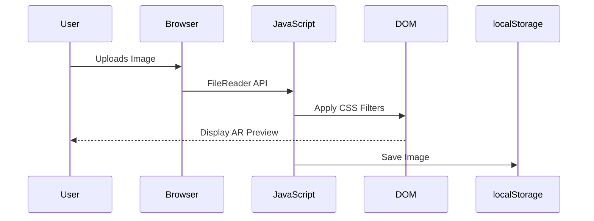

##  *(UML/Flowcharts)*

### **A. AR Demo Workflow**


### **B. Quiz Logic Flow**
```mermaid
graph TD
    A[Start Quiz] --> B{Question 1: Use Case?}
    B -->|Shopping| C[Recommend "IKEA Place"]
    B -->|Education| D[Recommend "JigSpace"]
    C --> E[Display Result]
    D --> E
```

