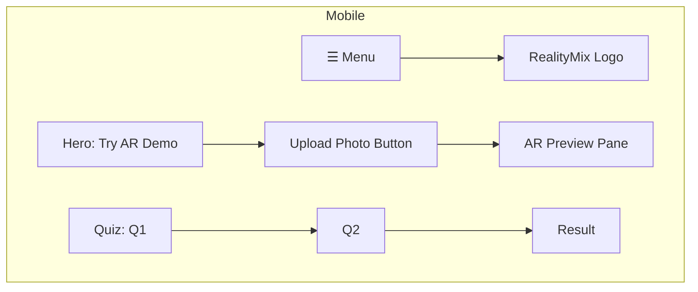
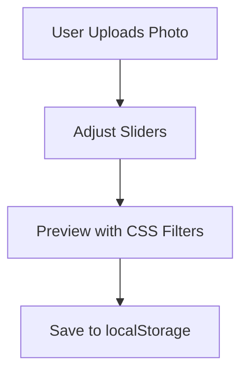
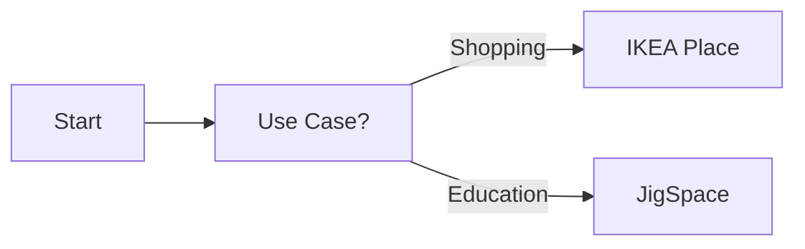

### **1. Mobile Wireframe**  
**Mermaid Code:**  

**Text Description:**  
- **Top Bar:** Hamburger menu + logo  
- **Hero Section:** Full-width "Try AR Demo" button  
- **AR Tool:** File upload → Preview pane (stacked vertically)  
- **Quiz:** Accordion-style questions  

---

### **2. Desktop Wireframe**  
**Mermaid Code:**  
```mermaid
flowchart LR
    subgraph Desktop
        A[RealityMix Logo] --> B[Home | Tutorials | Feedback]
        C[AR Controls] --> D[Upload | Sliders]
        D --> E[Live Preview]
        F[Sidebar Quiz] --> G[Q1 → Q2 → Result]
    end
```
**Text Description:**  
- **Top Bar:** Logo + horizontal nav  
- **Main Area:**  
  - **Left Column:** AR controls (upload, filter sliders)  
  - **Right Column:** Live preview (60% width)  
- **Sidebar:** Fixed AR quiz  

---

### **3. Key Components**  
#### **AR Demo Tool**  

#### **Quiz Flow**  

